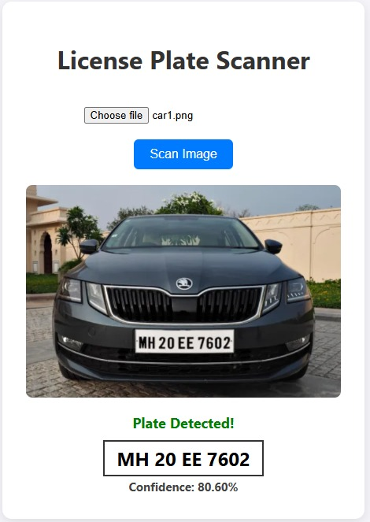
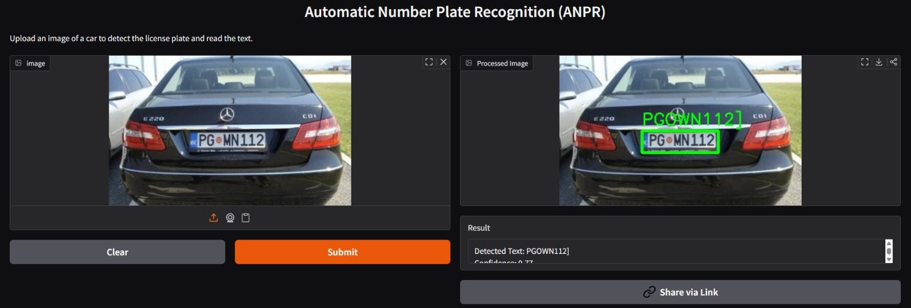

# 🚗 Automatic Number Plate Recognition (ANPR) System

A full-stack computer vision application that detects vehicle license plates and extracts the text using Deep Learning. Built with **YOLOv8** for object detection and **EasyOCR** for optical character recognition, wrapped in a **FastAPI** backend with a vanilla HTML/JS frontend.




### Link to dataset: [License Plate Recognition](https://universe.roboflow.com/roboflow-universe-projects/license-plate-recognition-rxg4e/dataset/11)

## 🌟 Features
* **Real-time Detection:** Uses a custom-trained YOLOv8 model (`best.pt`) to locate license plates with high accuracy (mAP50: ~97%).
* **Text Extraction:** Integrated EasyOCR to read alphanumeric characters from the detected plates.
* **GPU Acceleration:** Optimized for NVIDIA GPUs (CUDA) for <100ms inference speeds.
* **REST API:** Fast and documented API endpoints built with FastAPI.
* **User Interface:** Simple drag-and-drop web interface to test images instantly.

## 🛠️ Tech Stack
* **Model:** YOLOv8 (Ultralytics)
* **OCR:** EasyOCR (PyTorch)
* **Backend:** Python, FastAPI, Uvicorn
* **Frontend:** HTML5, CSS3, JavaScript (Fetch API)

## 🚀 Installation & Setup

### 1. Clone the Repository
```bash
git clone [https://github.com/akshat-kumar10/anpr-project/tree/main](https://github.com/akshat-kumar10/anpr-project/tree/main)
cd anpr-license-plate
```

### 2. Install Dependencies
It is recommended to use a virtual environment (Python 3.10 or 3.11).

```bash

pip install -r requirements.txt
Note: If you have an NVIDIA GPU, ensure you install the CUDA-enabled version of PyTorch first.
```
### 3. Run the Backend API
```bash

python -m uvicorn main:app --reload
The API will start at http://127.0.0.1:8000.
```
### 4. Open the Frontend
Simply double-click the index.html file to open it in your browser. Upload a car image to see the result!

## 📂 Project Structure
```bash

├── main.py             # FastAPI backend logic
├── index.html          # Frontend user interface
├── best.pt             # Custom trained YOLOv8 model
├── requirements.txt    # Python dependencies
└── README.md           # Project documentation
```
## 🧠 Model Training
The model was trained on a custom dataset using YOLOv8n for 20 epochs.

### Precision: 98.7%

### Recall: 93.2%

### mAP50: 97.2%

## 📝 Usage via API
You can also use the API programmatically:

```Python

import requests

url = "http://localhost:8000/detect"
files = {'file': open('car.jpg', 'rb')}
response = requests.post(url, files=files)
print(response.json())
```



## 🤝 Contributing
Feel free to open issues or submit pull requests if you have suggestions for improving the OCR accuracy or UI!
